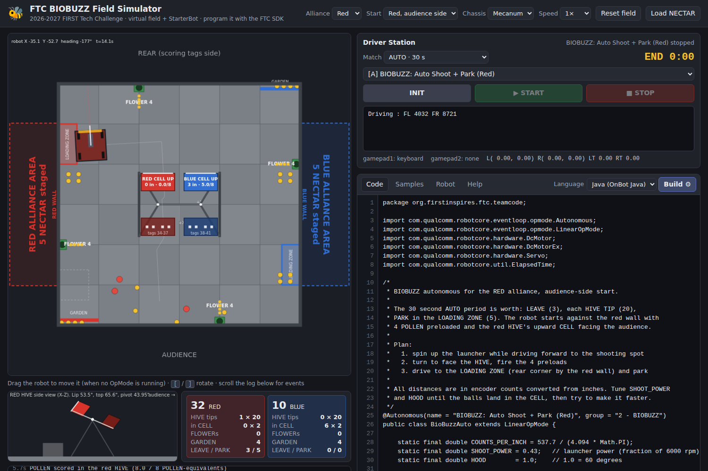

# FTC BIOBUZZ Field Simulator

A browser app that recreates the **2026-2027 FIRST Tech Challenge BIOBUZZ** field
at its real dimensions, with one virtual robot that has the motors, servos and
sensors of a real FTC StarterBot. Students program it exactly the way they
would program a real robot: paste an **OnBot Java OpMode** (`LinearOpMode` or
`OpMode`, `hardwareMap`, `gamepad1`, `telemetry`, `DcMotor`, `Servo`, `IMU`,
`DistanceSensor`, `ColorSensor`, `TouchSensor`, `VisionPortal` + `AprilTagProcessor`
…), press **Build**, then **INIT** and **START** on the on-screen Driver Station.



## Run it

```bash
node server.js          # or: npm start
# open http://127.0.0.1:8080/
```

No dependencies. Node 20+ is the only requirement. The tiny server exists only
because the OpMode runtime blocks its thread with `Atomics.wait` (like a real
`LinearOpMode`), which browsers allow only on pages served with the
cross-origin-isolation headers the server adds. If you host the files on GitHub
Pages or any static host instead, `coi-serviceworker.js` adds those headers via
a service worker and reloads once. Opening `index.html` straight from disk does
not work.

Drive with a USB or Bluetooth gamepad (press **START + A** to bind it as
gamepad1, **START + B** for gamepad2, exactly like the Driver Hub) or with the
keyboard (WASD = left stick, arrows = right stick, J/K/U/I = A/B/X/Y, Q/E =
triggers, N/M = bumpers, T/F/G/H = dpad). The **Help** tab lists everything.

## What is in the box

| Area | Where | Notes |
| --- | --- | --- |
| Field geometry | `src/field/geometry.js` | Section 9 (ARENA) of the Competition Manual: 144 in field, 24 in tiles, HIVE (pivot 43.95 in, 30° tilt, CELL lip 53.5 in / top 65.6 in, 25.5 in apart), four FLOWERs (4 in opening at 21.5 in), LOADING ZONEs, GARDENs, ALLIANCE AREAs, AprilTag clusters 30-45. Uses the official FTC field coordinate system. Details and sources: [docs/FIELD.md](docs/FIELD.md). |
| Rules and scoring | `src/field/rules.js` | AUTO 30 s / TELEOP 2:00, LEAVE 3, PARK 5, HIVE TIP 20, CELL element 2, FLOWER ownership, GARDEN 1, possession limit 4, NECTAR unlock per TIP. |
| Physics | `src/sim/world.js`, `motor-model.js`, `collision.js` | 200 Hz fixed step. DC motors with spin-up and the four run modes, encoders that count wheel rotation (they keep counting when the robot is stalled against a wall), mecanum/tank kinematics, wall and HIVE-frame collisions, POLLEN/NECTAR rolling on the tiles, launched balls with drag, HIVE mouth capture test in the CELL body frame, bi-stable tipping, FLOWER stacks, intake and feeder mechanisms. |
| Sensors | `src/sim/world.js`, `vision.js` | IMU (yaw/pitch/roll, rates), REV 2 m distance sensor (ray cast, 8190 mm when nothing in range), REV Color Sensor V3 in the intake, touch sensor on the front bumper, webcam with AprilTag cluster + single-tag detections that respect the field of view and which face of each CELL is turned toward the camera. |
| Virtual robot | `src/sim/robot-config.js` | 18 × 18 × 16 in mecanum StarterBot: four goBILDA 312 rpm drive motors (537.7 ticks/rev, 104 mm wheels), `intake` (435 rpm), `launcher` (6000 rpm bare motor + 96 mm wheel), `feeder` and `hood` servos, `gate` CR servo, `imu`, `sensor_distance`, `sensor_color`, `touch`, `Webcam 1`. Tank-style names `left_drive`/`right_drive` drive both wheels on a side so the stock SDK samples run unmodified. The **Robot** tab shows the configuration. |
| SDK look-alike | `src/sdk/hardware.js`, `opmode.js`, `lang.js` | Same class and method names as the FTC SDK. Runs in a Web Worker; hardware calls read/write a `SharedArrayBuffer` "bus". `sleep()`, `waitForStart()`, `opModeIsActive()` block like the real thing. Supported API: [docs/API.md](docs/API.md). |
| Java translator | `src/sdk/java2js.js` | Translates OnBot Java OpModes (classes, fields, methods, static finals, enums, casts, generics, for-each, lambdas, `String.format`, integer division …) to JavaScript while preserving line numbers, so runtime errors point at the Java line. JavaScript OpModes are accepted too. |
| Samples | `samples/` | The SDK's Basic Tank Drive, Field-Relative Mecanum, Auto Drive By Encoder and Auto Drive By Gyro samples run as-is; plus a BIOBUZZ TeleOp, a BIOBUZZ AUTO that shoots four preloads and tips the HIVE, an AprilTag aiming demo, a sensor tour and a blank template. |
| UI | `index.html`, `src/ui/` | Top-down field canvas (drag the robot, `[`/`]` to rotate), HIVE side view, live score, Driver Station with OpMode list, INIT/START/STOP, practice / AUTO / TELEOP / full-match timers, telemetry, gamepad status, code editor with samples, robot configuration and help tabs. |

## Tests

```bash
npm test
```

Node's built-in test runner covers the field geometry against the published
numbers, the motor/encoder model, driving and collisions, HIVE scoring and
tipping, intake rules, sensors and AprilTags, the Java translator (every
bundled sample plus targeted language features), and an end-to-end run of the
real worker executing Java OpModes.

## Assumptions and limits

* The manual does not publish how much mass tips a HIVE. Default: 8
  POLLEN-equivalents (a NECTAR counts 1.65 by mass). Change `tipMass` in
  `World` options.
* Element staging (4 POLLEN per FLOWER and per GARDEN, 3 NECTAR per upward
  CELL, 4 preloads per robot, 5 NECTAR per ALLIANCE AREA) follows the V1
  staging figure as transcribed by community tools; only one robot is
  simulated, so the other robots' preloads are left on the floor at their
  start positions.
* Nominal 144 in / 24 in dimensions are used (the manual's general tolerance
  is ± 1 in; an assembled AndyMark perimeter measures about 141 in inside).
* Not modelled: ball spin, other robots, motor current limits, precise hub
  bus timing, anonymous inner classes and interfaces in Java code.

## Sources

* 2026-2027 FIRST Tech Challenge Competition Manual (BIOBUZZ presented by
  RTX), V1, 12 September 2026 — Section 9 ARENA (page 63 onward) and Section
  10 Game Details. https://ftc-resources.firstinspires.org/ftc/game/manual
* Event Field Setup Guide 2026-2027. https://ftc-resources.firstinspires.org/ftc/archive/2027/field/eventfieldguide
* FTC Docs: Control System Introduction, Field Coordinate System, AprilTag
  documentation. https://ftc-docs.firstinspires.org/
* FTC Robot Controller SDK samples (Apache/BSD licensed) for the API shapes.
  https://github.com/FIRST-Tech-Challenge/FtcRobotController
